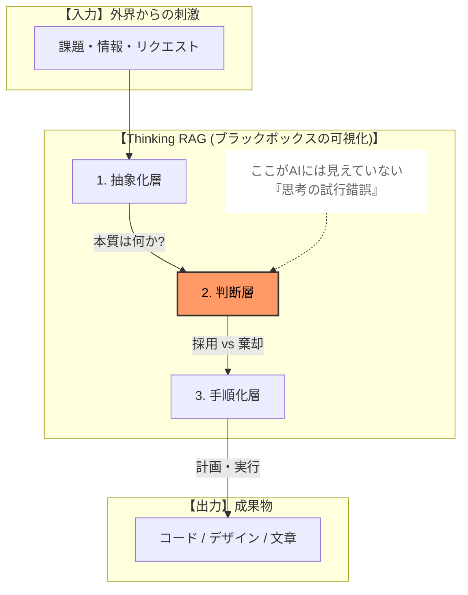
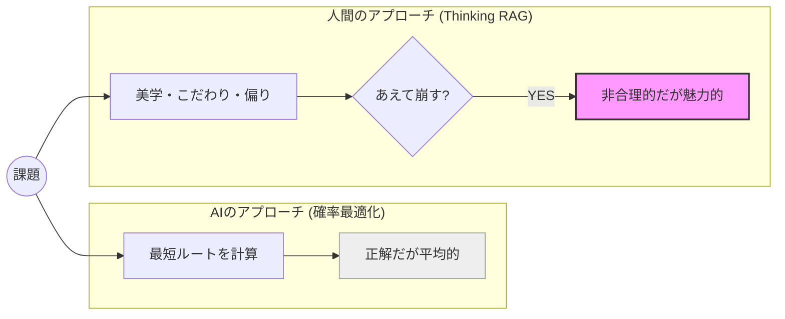
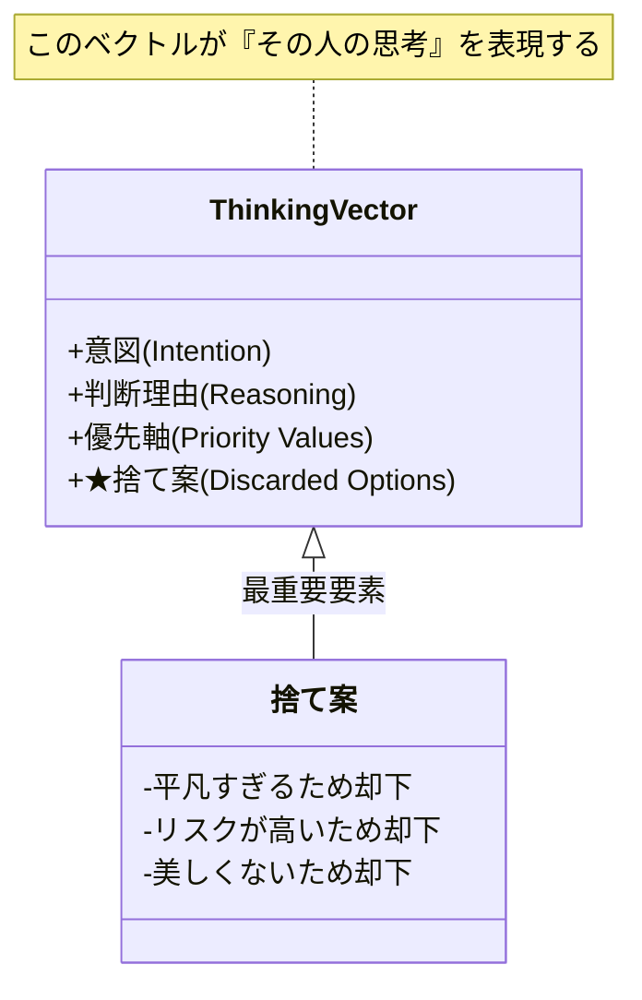
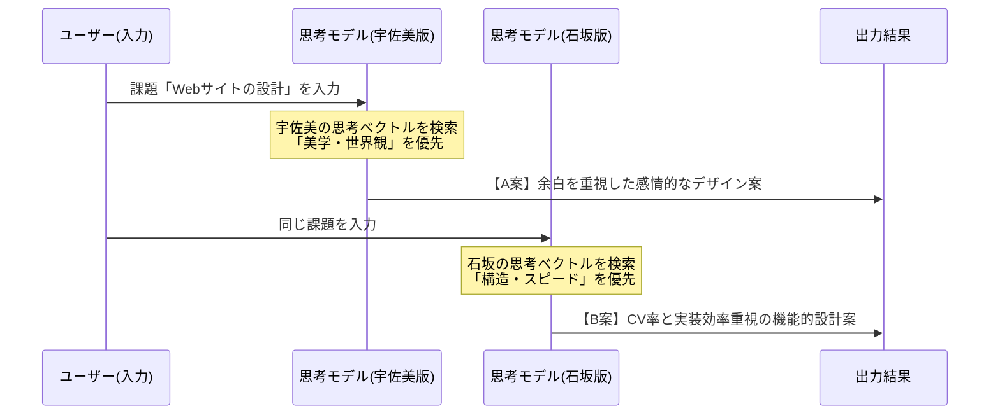
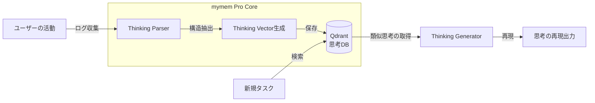

# **Thinking RAG — 思考を記憶し再現するAIフレームワーク（Whitepaper v1.2.1）**

**著者：石坂竹比古（CreativeCrew Inc. Vietnam） / 宇佐美良太（CreativeCrew Inc. Japan）**  
**共同研究・共同執筆**

---

# **1\. はじめに：AIによる「平均化」と、その限界**

近年の生成AIは、驚くべき速度で知的作業を民主化しました。  
専門知識がなくとも、誰もが「それらしい答え」にたどり着ける時代が到来しています。

しかし同時に、ある構造的な限界も明確になりつつあります。

**AIのアウトプットは、最適化されるほど「平均」に収束する。**

この挙動はエラーではなく、確率モデルとして極めて正しいものです。  
一方で、熟練したエンジニア、デザイナー、PM、職人の価値は、  
その平均点の外側に存在します。

彼らの価値は、

- どの問題を「本質」と捉えたか
- どの選択肢を「正解でもあえて捨てたか」
- なぜ非合理な判断を選んだか

という **思考の履歴** に宿ります。

Thinking RAG（Thinking Retrieval-Augmented Generation）は、  
従来のRAGが扱ってきた「知識」ではなく、

**人間が判断に至るまでの思考プロセスそのものを、  
再利用可能な構造として保存・検索・再適用するための  
新しいAIフレームワーク** です。

本ホワイトペーパーは、  
AIによる知的作業のコモディティ化に対抗し、  
**人間固有の「判断の偏り」を資産として扱うための  
設計思想と実装モデル** を定義します。

---

## **【要点（1章）】**

- AIの進化はアウトプットの平均化を加速させている
- 人間の価値は「何を捨てたか」に現れる
- Thinking RAG は思考プロセスを保存・再利用する枠組みである

---

# **2\. Thinking RAG の基本概念**

Thinking RAG は、人間の思考を完全に再現することを目的としません。  
また、思考をブラックボックスのまま模倣する技術でもありません。

本フレームワークが対象とするのは、  
**意思決定において繰り返し現れる判断の傾向・優先軸・棄却パターン** です。

つまり Thinking RAG とは、  
「考え方をコピーする技術」ではなく、  
**「考え方の型を参照可能にする技術」** です。

Thinking RAG は、RAGが扱う「知識」よりも上位のレイヤ、  
すなわち **思考の流れ（Flow of Thought）** を扱います。

### ■ Thinking RAG の思考層構造図

人間は結論を出す前に、  
「抽象化」と「判断」という不可視の工程を通過しています。  
Thinking RAG はこの工程を記録対象とします。

---

# **3\. 現在のAIが再現できない領域**

現在のAIは膨大な知識を扱えますが、  
**意志のある偏りを持った判断** はできません。

生成結果は常に確率的最適化の産物であり、  
「美学のために非合理を選ぶ」ことができないためです。

### ■ AIの最適化 vs 人間の美学

この **文脈を含んだ非合理性** こそが、Thinking RAG の対象領域です。

---

# **4\. 思考パターン抽出モデル**

Thinking RAG では、人間の思考を以下の4階層で捉えます。

- 抽象化層
- 判断層
- 手順化層
- 行動層

（※ 構造自体は変更なし、定義のみ明確化）

---

# **5\. 思考データの構造化：「捨て案」の重要性**

Thinking RAG において最も重要なデータは、  
最終的に選ばれた正解ではありません。

**選ばれなかった選択肢（捨て案）こそが、  
判断者の価値観を最も強く表します。**

本研究ではこれを **Negative Decision Data** と定義します。

### ■ Thinking Vector 構成要素図

---

# **6\. 再現可能な思考の設計**

Thinking RAG のゴールは、  
**特定の個人の思考テンプレートを生成すること** です。

（※ 人物定義・記述は内容変更なし）

---

# **7\. 実証実験と成功基準**

（※ マーメイド図・フロー構造は変更なし）

---

# **8\. 既存技術との明確な違い**

- CoT：正解に至る論理の道筋
- Thinking RAG：判断者の選択傾向そのもの

**正解の再現ではなく、判断者の再現。**

---

# **9\. 実装アーキテクチャ（mymem Pro）**

（※ マーメイド図そのまま）

---

# **10\. 具体的なユースケース**

（※ 3ケースとも内容変更なし、説明文のみ整理）

---

# **11\. 社会的意義：職能のデジタルツイン**

Thinking RAG は、  
知識の保存ではなく **職能知の保存** を目指します。

---

# **12\. リスクと倫理規定**

- 思考の本人性
- バイアス制御
- 透明性の担保

（※ 方針変更なし）

---

# **13\. まとめ**

Thinking RAG は、  
**人間の意思決定プロセスそのものを資産化するフレームワーク** です。

AIが高度化するほど、  
「何を知っているか」では差別化できなくなります。

最後に残る価値は、  
**どう考え、どこで踏みとどまり、何を捨てるか** です。

Thinking RAG は、  
その判断を未来に残すための基盤です。

---

## **Call to Action**

Thinking RAG の実証実験、  
mymem Pro の先行テストに興味のある方はご連絡ください。

---

本リポジトリは、Thinking RAG ホワイトペーパーの原典を公開するものです。
本ホワイトペーパーに関するすべての権利は著者に帰属します。
著者の明示的な許可なく、商用利用、再配布、改変（二次利用）を行うことはできません。