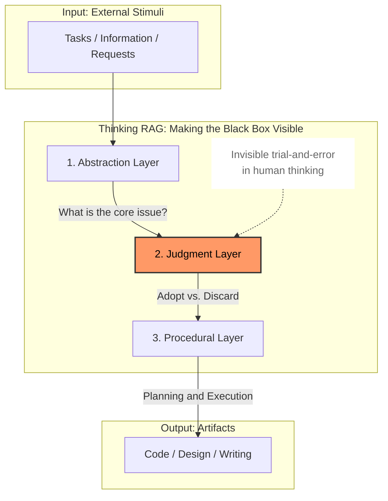
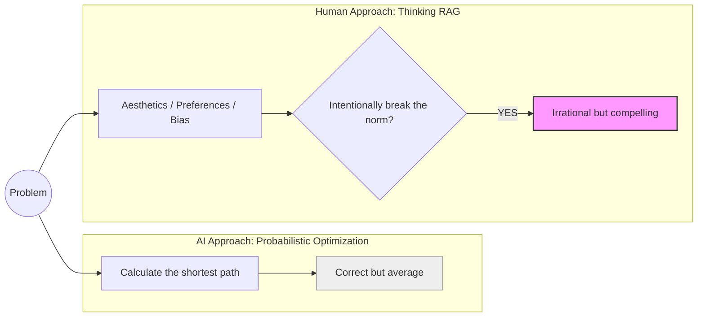
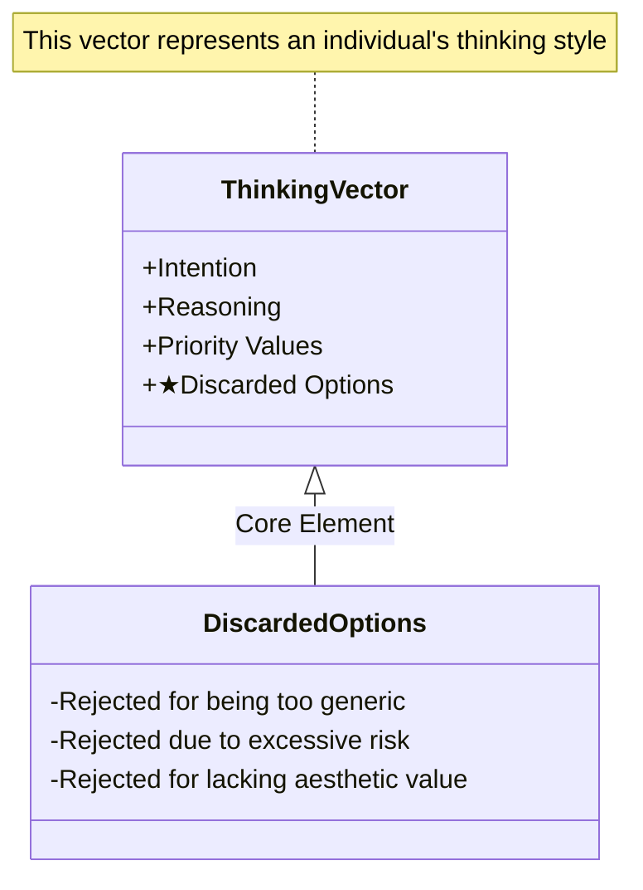
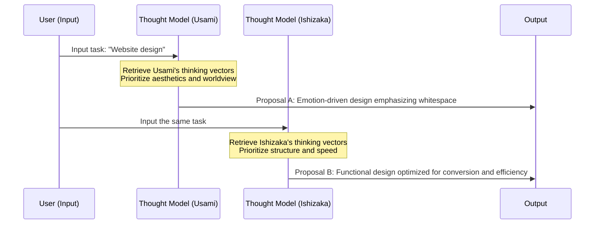
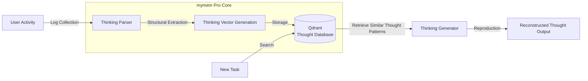

# **Thinking RAG — An AI Framework for Preserving and Reproducing Human Thought**

**(Whitepaper v1.2.1)**

**Authors: Takehiko Ishizaka (CreativeCrew Inc. Vietnam) / Ryota Usami (CreativeCrew Inc. Japan)**  
**Joint Research and Co-Authorship**

---

# **1\. Introduction: AI-Driven Averaging and Its Limits**

Recent advances in generative AI have rapidly democratized intellectual work.  
Even without deep expertise, almost anyone can now reach outputs that appear reasonable.

At the same time, a structural limitation has become increasingly apparent.

**The more AI systems are optimized, the more their outputs converge toward the average.**

This behavior is not a flaw—it is an inherent property of probabilistic models.  
However, the true value of experienced engineers, designers, project managers, and craftsmen lies precisely **outside** that average.

Their value resides in:

- What they identify as the *core essence* of a problem
- Which options they deliberately discard, even when those options are technically correct
- Why they choose decisions that appear irrational on the surface

In short, their value is embedded in their **history of thinking and judgment**.

Thinking RAG (Thinking Retrieval-Augmented Generation) is not a framework for handling knowledge in the traditional RAG sense.  
Instead, it is a new AI framework designed to:

**Preserve, retrieve, and reapply the human thought process itself—  
as a reusable, structured asset—  
leading up to judgment and decision-making.**

This whitepaper defines the design philosophy and implementation model for treating  
**human-specific judgmental bias** as an asset,  
in direct response to the commoditization of intellectual work driven by AI.

---

## **Key Points (Chapter 1)**

- Advances in AI accelerate the averaging of outputs
- Human value appears most clearly in what is deliberately discarded
- Thinking RAG is a framework for preserving and reusing thought processes

---

# **2\. Core Concept of Thinking RAG**

Thinking RAG does not aim to fully replicate human thought.  
Nor does it attempt to imitate thinking as a black box.

What this framework targets are:

**Recurring patterns in decision-making—  
judgment tendencies, priority axes, and rejection behaviors.**

In other words, Thinking RAG is not  
“a technology for copying how someone thinks,”  
but rather  
**“a technology for making thinking patterns referenceable.”**

Thinking RAG operates at a layer above the “knowledge” handled by traditional RAG—  
namely, the **flow of thought** itself.

### ■ Structural Layers of Thinking RAG

Before reaching a conclusion, humans pass through invisible stages of  
**abstraction** and **judgment**.  
Thinking RAG explicitly treats these stages as recordable and reusable targets.

---

# **3\. What Current AI Cannot Reproduce**

Modern AI systems can handle vast amounts of knowledge,  
but they cannot produce **intentional, bias-driven judgment**.

Their outputs are the result of probabilistic optimization,  
which prevents them from choosing irrational paths *for the sake of aesthetics, philosophy, or belief*.

### ■ AI Optimization vs. Human Aesthetics

This **context-aware irrationality** is precisely the domain Thinking RAG aims to capture.

---

# **4\. Thought Pattern Extraction Model**

Thinking RAG models human thinking across four layers:

- Abstraction Layer
- Judgment Layer
- Procedural Layer
- Action Layer

(*The structure itself remains unchanged; definitions are clarified only.*)

---

# **5\. Structuring Thought Data: The Importance of Discarded Options**

In Thinking RAG, the most important data is not the final selected answer.

**Discarded options reveal a decision-maker’s values far more clearly.**

In this research, we define this as **Negative Decision Data**.

### ■ Thinking Vector Components

---

# **6\. Designing Reproducible Thought**

The goal of Thinking RAG is to  
**generate reproducible thought templates for specific individuals.**

(*Individual definitions and descriptions remain unchanged.*)

---

# **7\. Validation Experiments and Success Criteria**

---

# **8\. Clear Differences from Existing Technologies**

- **Chain of Thought:** Logical steps toward a correct answer
- **Thinking RAG:** The decision-maker’s selection tendencies

**Not reproducing answers—but reproducing judgment.**

---

# **9\. Implementation Architecture (mymem Pro)**

---

# **10\. Practical Use Cases**

(*All three cases unchanged; explanatory text refined only.*)

---

# **11\. Social Impact: Toward Digital Twins of Professional Expertise**

Thinking RAG does not aim to preserve knowledge,  
but to preserve **professional expertise itself**.

---

# **12\. Risks and Ethical Principles**

- Ownership of thought
- Bias control
- Transparency and traceability

(*Policy unchanged.*)

---

# **13\. Conclusion**

Thinking RAG is a framework for  
**treating human decision-making processes as durable assets.**

As AI continues to advance,  
*what* one knows will no longer be a differentiator.

What remains is:

**how one thinks,  
where one hesitates,  
and what one chooses to discard.**

Thinking RAG provides the foundation for preserving those judgments for the future.

---

## **Call to Action**

If you are interested in validation experiments for Thinking RAG  
or early access to **mymem Pro**,  
we invite you to get in touch.

---

This repository publishes the original Thinking RAG whitepaper.
All rights are reserved by the authors.
Commercial use, redistribution, or derivative works are not permitted without explicit permission.
