# Thinking Workflow UI v1.7

## 思考ルートを可視化し、操作・再生・研究・共有可能にするUI設計

### ― 判断を奪わず、視野だけを拡張するための思考インフラ ―

**Whitepaper v1.7（Japanese Edition） 2026/01/14**

**著者：石坂竹比古（CreativeCrew Inc. Vietnam） / 宇佐美良太（CreativeCrew Inc. Japan）**  
**共同研究・共同執筆**

**関連ドキュメント**
- [Thinking RAG ホワイトペーパー（英語版）](README.md)
- [Thinking RAG ホワイトペーパー（日本語版）](README-ja.md)
- [Thinking Workflow UI ホワイトペーパー（英語版）](Thinking_WorkFlow_UI.md)
- [Thinking Workflow UI ホワイトペーパー（日本語版）](Thinking_WorkFlow_UI-ja.md)

---

## 0\. 本ホワイトペーパーの位置づけ

本書は、  
**Thinking RAG ― 思考を記憶し再現するAIフレームワーク**  
の思想を、UIレイヤーへ拡張・具現化するための設計書である。

Thinking RAG が扱ったのは、

- 人間の思考を  
    **どのように記録し**
- 構造化し
- 再利用可能な資産として保存するか

という **基盤思想と実装モデル**であった。

本書が扱うのは、その次の問いである。

> 思考は保存できても、  
> それを人間が理解し、追体験し、  
> なおかつ判断の主体性を失わずに使えるのか。

Thinking Workflow UI は、  
Thinking RAG によって記録された思考を、

**人間が「歩いて理解できる形」に翻訳するためのUI**  
である。

---

## 1\. mymem 設計思想（最上位原則）

Thinking Workflow UI は、  
**mymem の最上位原則に完全に従属するUI**として設計されている。

### mymem の基本コンセプト

mymem は、  
AIが人間の代わりに「正しい判断」を下すツールではない。

mymem が目指すのは、

> **人間が考え続けるための知的インフラ**

である。

AIがどれだけ賢くなっても、

- 何が大切か
- 何を犠牲にしてよいか
- なぜそれを選ぶのか

といった **価値そのものを選ぶ主体**にはなり得ない。

価値判断を AI に委ねた瞬間、  
それは「判断」ではなく **事実**になる。

価値が事実化した瞬間、  
人間は問い直す権利を失う。

mymem は、その状態を **意図的に避ける**。

---

## 2\. 判断の二層構造

mymem では「判断」を次の二層に分けて考える。

### 2.1 価値判断（人間が担う）

- ゴールを何に置くか
- 何を優先するか
- どのリスクを許容するか
- 誰が責任を引き受けるか

👉 **これは常に人間が担う**

### 2.2 条件に基づく最適化（AIが担う）

- 依存関係の整理
- 実行順序の計算
- ボトルネックの特定
- 前提条件下での探索

👉 **AIは提案まで。確定はしない**

Thinking Workflow UI は、  
この **価値判断レイヤーを侵食しないためのUI**である。

---

## 3\. はじめに

### 思考は保存できても、理解できなければ再利用できない

Thinking RAG により、

- 思考はテキストでも
- 知識でもなく
- **判断の流れ**として保存可能になった。

しかし実証を進める中で、次の課題が明確になった。

- 思考ログは読めても追体験できない
- 他人の思考は理解コストが高い
- 分岐・迷い・引き返しが見えない

これは技術の問題ではない。  
**表現の問題**である。

人間は本来、  
思考を **時間と空間の中での移動**として認識している。

この前提をUIに反映しない限り、  
思考の再利用は成立しない。

---

## 4\. Thinking Workflow UI が解こうとしている課題

### 従来の思考記録の限界

| 手法 | 欠落する要素 |
| --- | --- |
| テキストログ | 流れ・迷い |
| 箇条書き | 戻り・試行錯誤 |
| フローチャート | 揺らぎ・停滞 |

特に欠落しているのは次の情報である。

- どの思考操作を使ったか
- その内部で何を確認したか
- 結果として **何を捨て、何を残したか**

Thinking Workflow UI は、  
この欠落を **UI構造そのもので補う**ことを目的とする。

---

## 5\. 基本思想

### 思考は線ではなく、移動である

Thinking Workflow UI の前提は明確である。

- 思考は線ではない
- 思考はリストでもない
- 思考は **移動**である

したがってUIは、

- ドキュメントでも
- ダッシュボードでもなく
- **地図**であるべきだと結論づけた。

---

## 6\. 思考を構成するレイヤー構造

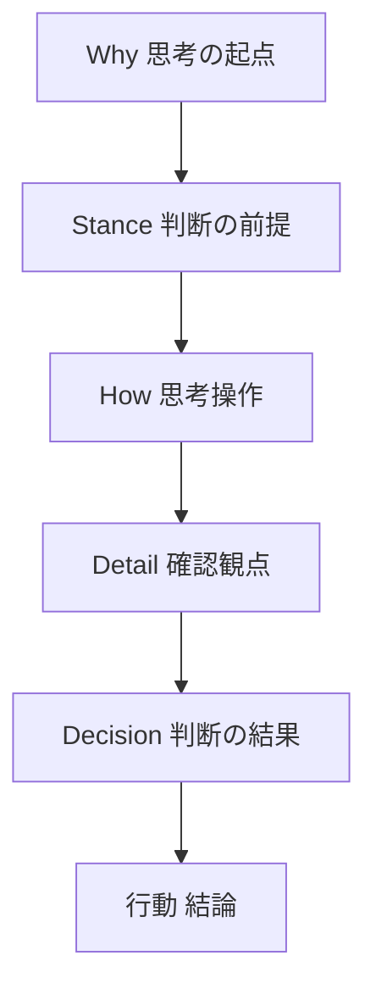

---

### 6.1 Why レイヤー：思考のトリガー

| 分類 | 意味 |
| --- | --- |
| 状態 | 内的なコンディション |
| 刺激 | 外部からの出来事 |
| 衝動 | 瞬間的な違和感 |
| 意思 | 意図的な開始 |
| 習慣 | 無意識の反射 |

Why レイヤーは、  
思考が「なぜ始まったか」を示す入口である。

正しさや能力とは無関係であり、  
UI上では過度に強調されない。

---

### 6.2 Stance レイヤー：思考スタンス

Stance は思考操作ではない。  
**判断が行われる前提条件**である。

| 軸 | 左 | 右 |
| --- | --- | --- |
| 感情 × 論理 | 感覚 | 筋道 |
| 具体 × 抽象 | 個別 | 構造 |
| 現在 × 未来 | 今 | 先 |
| 速度 × 完成度 | 早さ | 丁寧 |
| 個人 × 全体 | 自分 | みんな |
| 安定 × 変化 | 維持 | 挑戦 |

---

### 6.3 How レイヤー：8つの思考操作（共通地形）

| ID | 操作 | 役割 |
| --- | --- | --- |
| 0 | 組み合わせる | 統合 |
| 1 | 分ける | 分解 |
| 2 | 反転する | 逆転 |
| 3 | 置き換える | 代替 |
| 4 | 拡大・縮小する | スケール |
| 5 | 視点を変える | 立場 |
| 6 | 時間をずらす | 時系列 |
| 7 | 制約を足す | 条件 |

これら8つは、

- 常に存在し
- 増えも減りもしない
- 正解や優劣を持たない

**思考を動かすための共通地形**である。

---

### 6.4 詳細観点：思考操作の内部で確認される視点

各思考操作の内部では、  
人は無意識に次の観点を確認している。

| 観点 | 本質 |
| --- | --- |
| 目的 | 何を目指すか |
| 手段 | どうやるか |
| リスク | 失敗しないか |
| 前提 | 何を仮定しているか |
| 結果 | 何が起きるか |
| 関係 | 誰・何に影響するか |
| 文脈 | いつ・どんな状況か |
| 感情 | 違和感はないか |

これらは  
**判断そのものではなく、判断前の確認項目**である。

---

### 6.5 デフォルト観点：判断結果を残すための共通メタ情報

詳細観点を確認した結果、  
人は必ず何らかの判断を行っている。

Thinking Workflow UI では、  
この **判断結果を欠損させないための共通項目**を定義する。

これを  
**デフォルト観点（Default Perspectives）**と呼ぶ。

| 観点 | 役割 |
| --- | --- |
| Kept | 採用した判断 |
| Discarded | 意図的に捨てた判断 |
| Timing Reason | なぜ今それを行ったか |
| Remaining Options | 捨てたが殺していない案 |
| Clarified Result | 捨てたことで明確になったこと |

#### 設計上の重要な前提

- これら5観点は  
    **必ずすべてが判別・記述できるとは限らない**
- 判断できない場合は  
    **未記載でよい**
- 未記載は欠損ではなく、  
    **判断が明確化されていないという事実**を示す

デフォルト観点は、

- ユーザーに入力を強制しない
- UI操作の主役にはならない
- 判断を評価するためのものではない

**判断の痕跡を未来へ渡すためのメタ情報**である。

---

## 7\. デフォルト観点が RAG メタデータとして持つ価値

デフォルト観点が蓄積されることで、  
Thinking RAG は次のような再利用が可能になる。

- よく捨てられる判断の傾向
- 保留が発生しやすい条件
- 判断が明確になるまでの思考操作の流れ
- 個人・チーム・組織ごとの判断特性

これは、

- 正解データでもなく
- ナレッジベースでもない

**判断の履歴そのものの再利用**である。

---

## 8\. Thinking RAG と Workflow UI の役割分担

| 項目 | Thinking RAG | Workflow UI |
| --- | --- | --- |
| 主体 | AI | 人間 |
| 扱う対象 | 判断メタ情報 | 判断の体験 |
| 再利用 | 検索・分析 | 理解・追体験 |

AIは提案を行うが、  
**判断は常に人間に残される。**

---

## 9\. まとめ

- 思考操作は地形
- 詳細観点は確認
- デフォルト観点は判断結果のメタ情報
- すべてが埋まる必要はない
- **未確定も含めて思考の履歴である**

Thinking Workflow UI は、  
思考を正解に導くための道具ではない。

**判断がどのように行われたかを、  
失わずに未来へ渡すためのUI**である。

---

## 10\. 他人の思考をなぞることの価値と危険性

他人の思考をなぞることは、

- 視野を広げ
- 思考の慣性を壊し
- ブレークスルーを生む

強力な学習手段である。

しかし、以下の状態に入った瞬間、  
Thinking Workflow UI は  
**mymem の最上位原則と正面から衝突する**。

- 正解・最適・成功ルートの提示
- 推奨・スコア・成功率の表示
- 「この通り進めばよい」という解釈が可能になる状態

これは、

> AIに価値を選ばせない  
> 最も重要な判断を事実化しない

という mymem の思想と、  
**思想レベルで明確に衝突する**。

---

## 11\. v1.7 の解

### Shadow Replay という設計パターン

### Shadow Replay とは

Shadow Replay とは、

> 他人の思考を  
> **「ナビ」ではなく「影」として再生する**  
> 思考ワークフロー参照モードである。

Shadow Replay は v1.7 における  
**代表的な実装例の一つ**であり、  
同思想に基づく他の実装を排除するものではない。

---

## 12\. Shadow Replay の設計原則

### 見せてよいもの

- 通過した思考視点
- 滞在時間
- 引き返し回数
- 迷いの集中点

### 見せてはいけないもの

- 次の一手
- 判断理由の要約
- 結論
- 良否・成功・評価

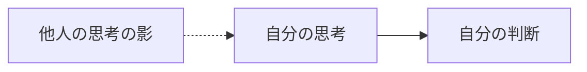

> 視野は広がるが、進路は示されない。

---

## 13\. 利用目的についての整理

Shadow Replay は  
**研究・学習用途を主目的として設計されている**。

ただし、その利用は研究・学習に限定されない。

- 思考比較
- 意思決定の振り返り
- ナレッジ背景理解
- チーム内レビュー
- 自己内省

など、  
**判断を代替しない範囲**での活用が可能である。

---

## 14\. まとめ

### v1.7 における到達点

- 思考は保存できる
- 判断は欠損しない
- 迷いは価値として残る
- 他人の思考から学べる
- それでも判断は常に自分のもの

Thinking Workflow UI は、

> **判断を奪わずに、  
> 思考の可能性だけを最大化するUI**

として、  
v1.7で一つの完成点に到達した。

---

## 15\. UIスクリーンショット

- DEMO URL : https://thinking-rag-ui-demo.mymem.net/

### PC

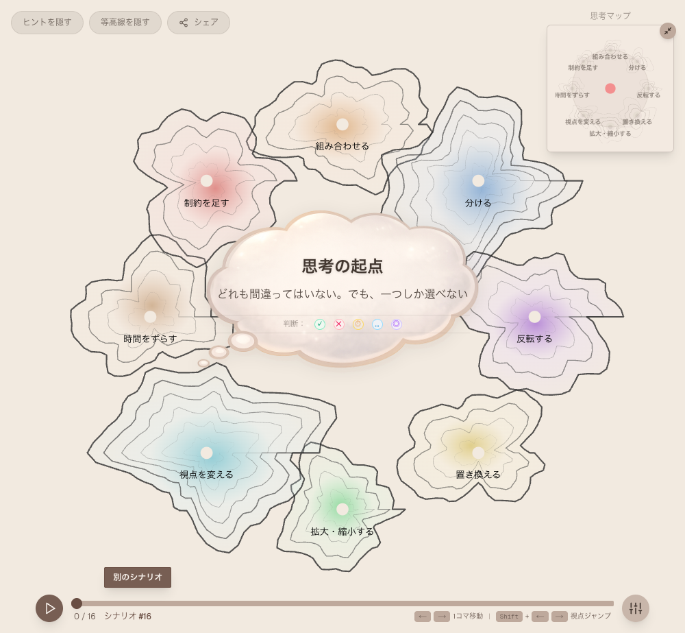
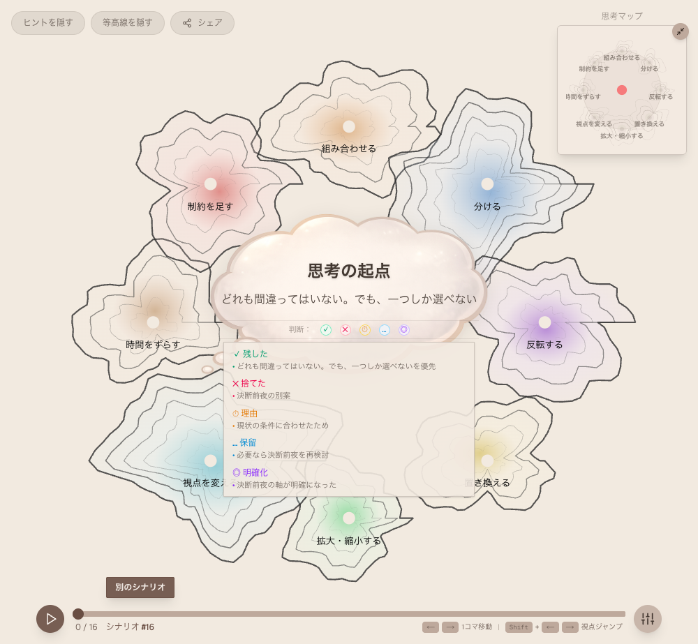
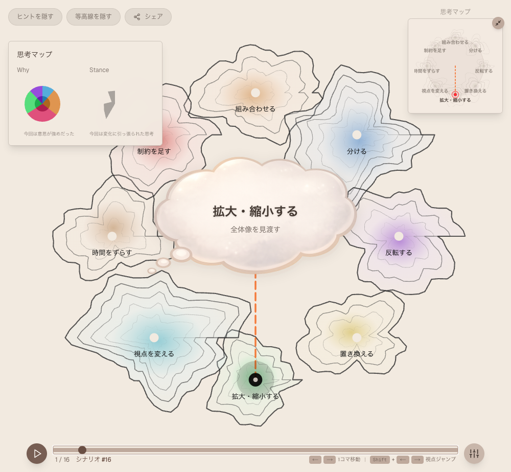
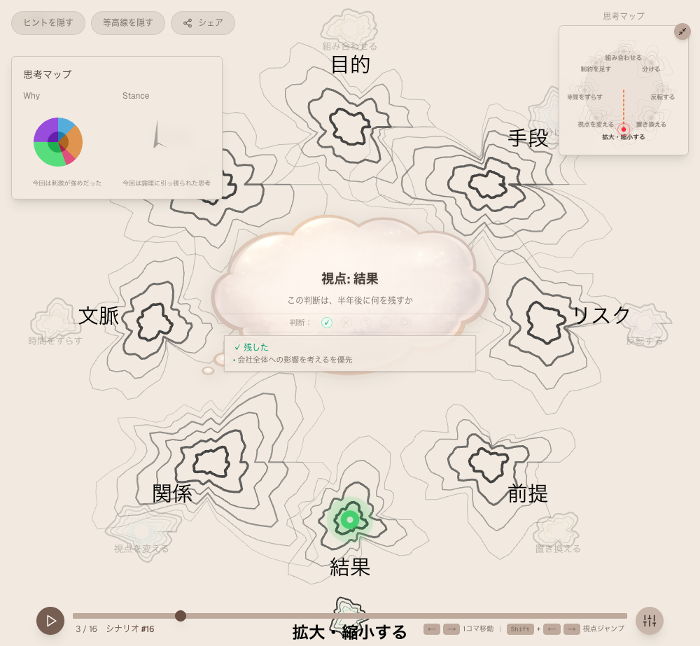
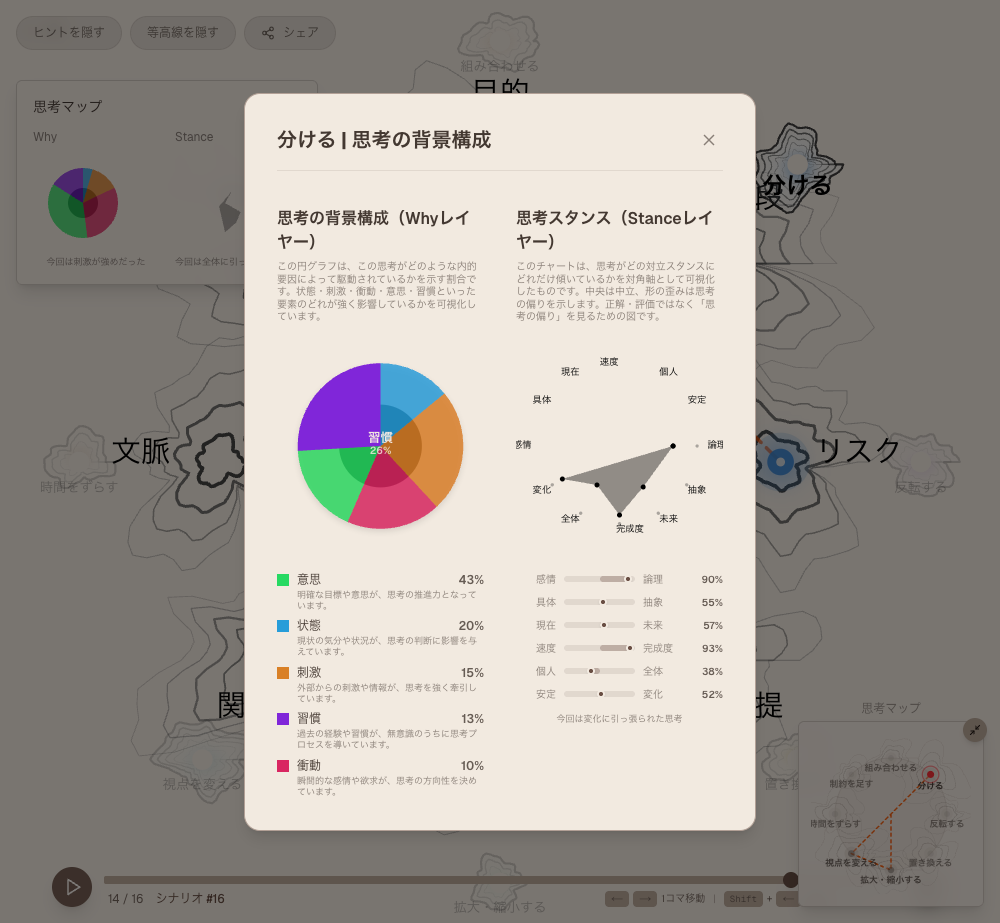
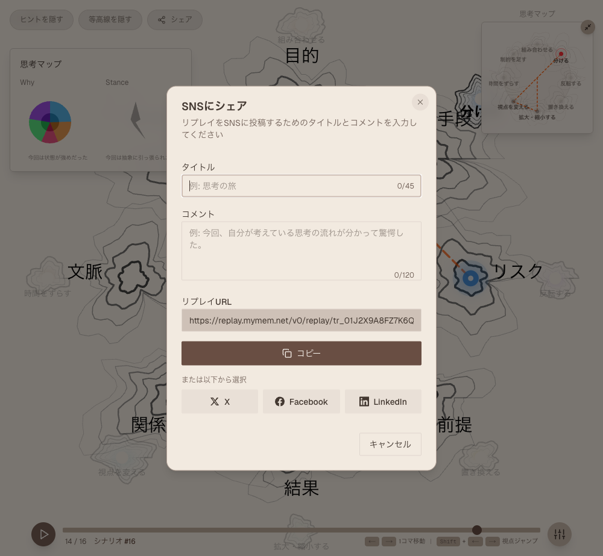
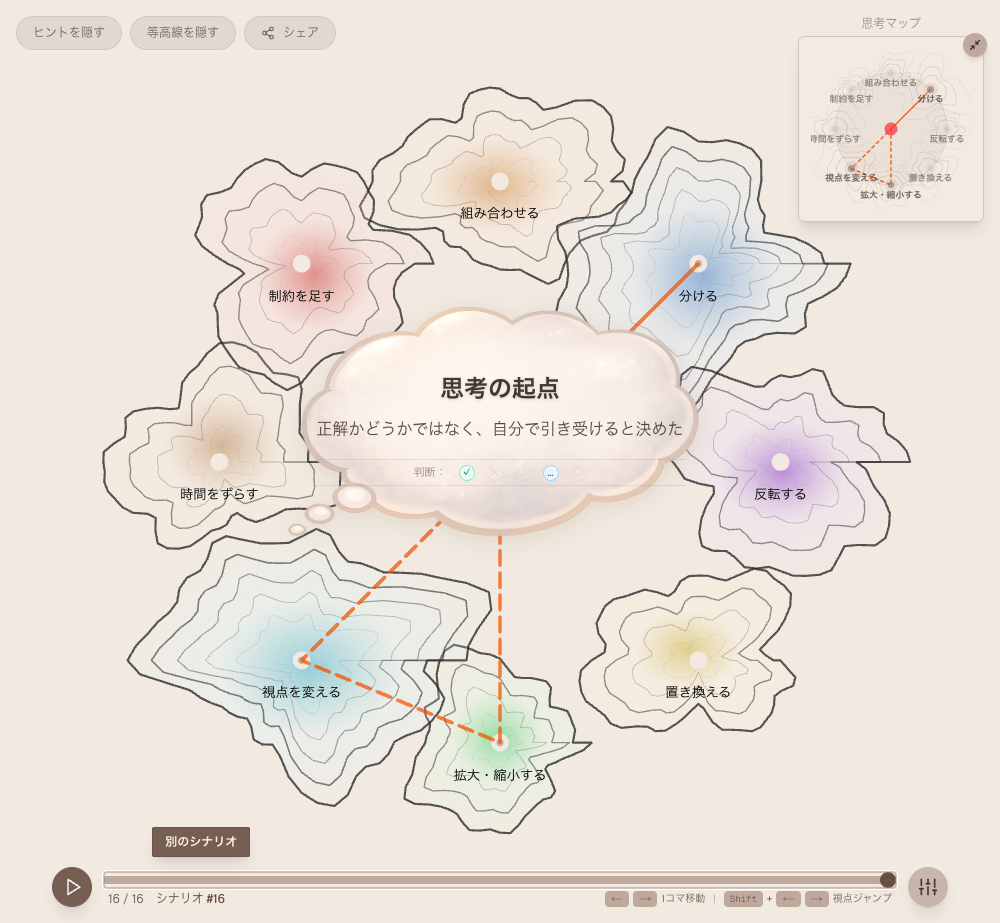

### スマホ

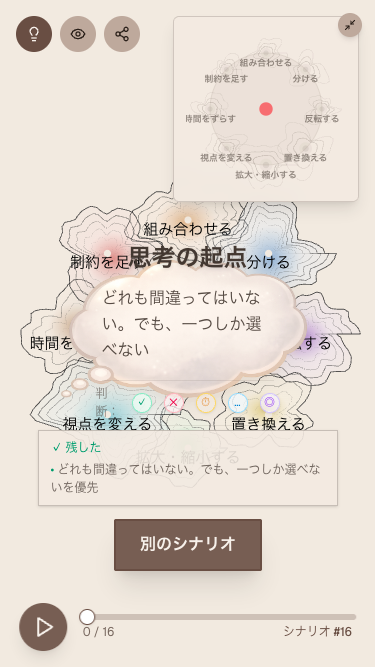
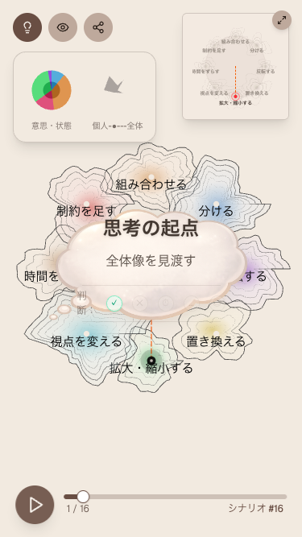
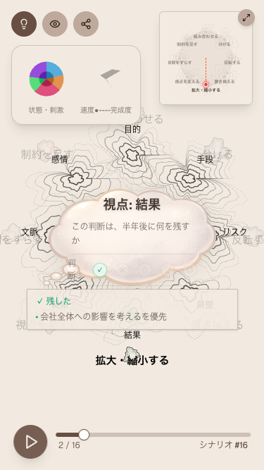
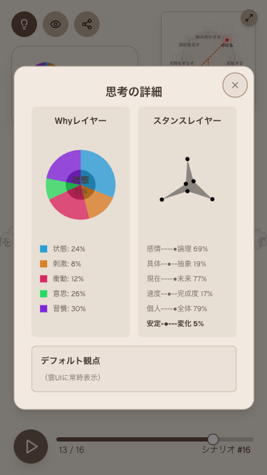
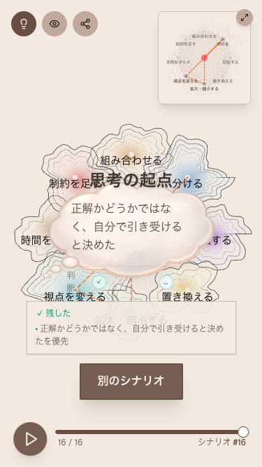

---

## Call to Action

- Thinking Workflow UI デモ公開
- mymem Pro 実証リリース
- Shadow Replay を含む思考研究・実装検証
- mymem Thinking Rag Engine を利用した応用プロダクト例
- mymem Pro の先行テストに興味のある方はご連絡ください。

---

本リポジトリは、Thinking RAG ホワイトペーパーの原典を公開するものです。
本ホワイトペーパーに関するすべての権利は著者に帰属します。
著者の明示的な許可なく、商用利用、再配布、改変（二次利用）を行うことはできません。
