# Thinking Workflow UI v1.7

## A UI design to visualize, operate, replay, research, and share thinking routes

### A thinking infrastructure that expands perspective without taking away judgment

**Whitepaper v1.7 (English Edition) 2026/01/14**

**Authors: Takehiko Ishizaka (CreativeCrew Inc. Vietnam) / Ryota Usami (CreativeCrew Inc. Japan)**  
**Co-research / Co-authored**

**Documents**
- [Thinking RAG Whitepaper (EN)](README.md)
- [Thinking RAG Whitepaper (JA)](README-ja.md)
- [Thinking Workflow UI Whitepaper (EN)](Thinking_WorkFlow_UI.md)
- [Thinking Workflow UI Whitepaper (JA)](Thinking_WorkFlow_UI-ja.md)

---

## 0. Positioning of This Whitepaper

This document is a design paper that extends and materializes the philosophy of  
**Thinking RAG - an AI framework that memorizes and reproduces thinking**  
at the UI layer.

Thinking Workflow UI is one of the core UI layers built on top of the mymem Thinking RAG Engine.

Thinking RAG focused on:

- How to **record** human thinking
- How to structure it
- How to store it as a reusable asset

This whitepaper addresses the next question:

> Even if we can preserve thinking,  
> can humans understand it, relive it,  
> and still keep ownership of their judgment?

Thinking Workflow UI translates the thinking recorded by Thinking RAG into  
**a UI that humans can walk through and understand.**

---

## 1. mymem Design Philosophy (Top-Level Principle)

Thinking Workflow UI is designed as a UI  
**fully subordinated to mymem's top-level principle.**

### The Core Concept of mymem

mymem is not a tool that lets AI make the "right decisions" on behalf of people.

What mymem aims for is:

> **An intellectual infrastructure that lets humans keep thinking.**

No matter how smart AI becomes,  
it cannot be the agent that chooses values such as:

- What truly matters
- What can be sacrificed
- Why a choice is made

The moment value judgment is delegated to AI,  
it stops being "judgment" and becomes **fact.**

Once value turns into fact, humans lose the right to reconsider.

mymem **intentionally avoids** that state.

---

## 2. The Two-Layer Structure of Judgment

In mymem, "judgment" is split into two layers.

### 2.1 Value Judgment (Handled by Humans)

- Where to place the goal
- What to prioritize
- Which risks to accept
- Who takes responsibility

Note: **This is always the human's role.**

### 2.2 Optimization Under Constraints (Handled by AI)

- Organizing dependencies
- Calculating execution order
- Identifying bottlenecks
- Searching within given constraints

Note: **AI proposes, but does not confirm.**

Thinking Workflow UI is a UI that  
**does not encroach on the value-judgment layer.**

---

## 3. Introduction

### Even if thinking can be stored, it cannot be reused without understanding

With Thinking RAG:

- Thinking is no longer just text
- Or knowledge
- But can be preserved as a **flow of judgment**

However, practical validation revealed clear challenges:

- You can read a thinking log, but you can't relive it
- Understanding someone else's thinking is costly
- Branches, hesitation, and backtracking are invisible

This is not a technical problem.  
It is a **representation problem.**

Humans naturally recognize thinking as  
movement through time and space.

Unless this premise is reflected in the UI,  
the reuse of thinking cannot be realized.

---

## 4. The Problem Thinking Workflow UI Solves

### Limitations of Conventional Thinking Records

| Method | Missing Elements |
| --- | --- |
| Text logs | Flow and hesitation |
| Bullet lists | Backtracking and trial-and-error |
| Flowcharts | Fluctuation and stagnation |

What is especially missing is:

- Which thinking operation was used
- What was checked inside that operation
- As a result, **what was discarded and what was kept**

Thinking Workflow UI aims to  
**fill these gaps through UI structure itself.**

---

## 5. Core Philosophy

### Thinking is not a line, but movement

The premise of Thinking Workflow UI is clear:

- Thinking is not a line
- Thinking is not a list
- Thinking is **movement**

Therefore the UI should be:

- Not a document
- Not a dashboard
- But a **map**

---

## 6. Layered Structure of Thinking

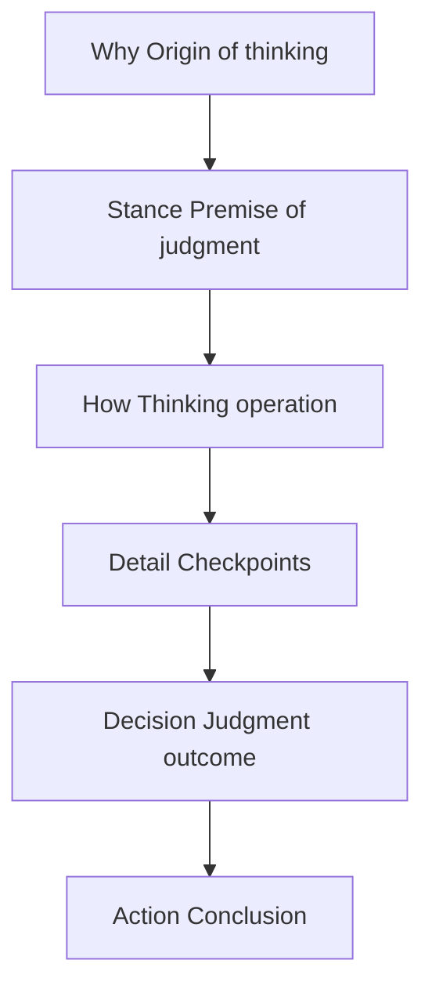

---

### 6.1 Why Layer: Trigger of Thinking

| Category | Meaning |
| --- | --- |
| State | Internal condition |
| Stimulus | External event |
| Impulse | A momentary sense of discomfort |
| Intent | Deliberate start |
| Habit | Unconscious reflex |

The Why layer is the entry point that indicates  
why thinking began.

It is unrelated to correctness or ability,  
and should not be overly emphasized in the UI.

---

### 6.2 Stance Layer: Thinking Stance

Stance is not a thinking operation.  
It is the **premise under which judgment is made.**

| Axis | Left | Right |
| --- | --- | --- |
| Emotion x Logic | Intuition | Reasoning |
| Concrete x Abstract | Particular | Structure |
| Present x Future | Now | Later |
| Speed x Completeness | Fast | Thorough |
| Individual x Whole | Self | Everyone |
| Stability x Change | Maintain | Challenge |

---

### 6.3 How Layer: The 8 Thinking Operations (Common Terrain)

| ID | Operation | Role |
| --- | --- | --- |
| 0 | Combine | Integration |
| 1 | Split | Decomposition |
| 2 | Invert | Reversal |
| 3 | Replace | Alternative |
| 4 | Scale Up/Down | Scale |
| 5 | Shift Perspective | Position |
| 6 | Shift Time | Timeline |
| 7 | Add Constraints | Conditions |

These eight operations:

- Always exist
- Neither increase nor decrease
- Have no correctness or superiority

They are the **common terrain for moving thinking.**

---

### 6.4 Detail Perspectives: What Is Checked Inside Operations

Within each thinking operation,  
people unconsciously check the following:

| Perspective | Essence |
| --- | --- |
| Purpose | What are we aiming for? |
| Means | How will we do it? |
| Risk | Will it fail? |
| Premise | What is assumed? |
| Result | What will happen? |
| Relationship | Who/what is affected? |
| Context | When/under what situation? |
| Emotion | Any discomfort? |

These are **not judgments themselves,**  
but checkpoints before judgment.

---

### 6.5 Default Perspectives: Common Metadata for Preserving Judgments

After checking the detail perspectives,  
people inevitably make some form of judgment.

Thinking Workflow UI defines  
**common items that prevent judgment outcomes from being lost.**

These are called  
**Default Perspectives.**

| Perspective | Role |
| --- | --- |
| Kept | Accepted judgment |
| Discarded | Intentionally discarded judgment |
| Timing Reason | Why it was done now |
| Remaining Options | Options dropped but not killed |
| Clarified Result | What became clear by discarding |

#### Critical Design Assumptions

- These five perspectives  
    **cannot always be fully identified or described**
- If judgment is not possible,  
    **it is acceptable to leave it blank**
- Blank does not mean loss; it indicates  
    **that judgment has not been clarified**

Default Perspectives:

- Do not force user input
- Are not the main focus of UI interaction
- Are not for evaluating judgments

They are **metadata that carries traces of judgment into the future.**

---

## 7. Value of Default Perspectives as RAG Metadata

As Default Perspectives accumulate,  
Thinking RAG enables reuse such as:

- Patterns of frequently discarded judgments
- Conditions where deferral tends to occur
- The flow of operations until judgment becomes clear
- Judgment characteristics by individual, team, or organization

This is:

- Not correct answers
- Not a knowledge base

But **the reuse of judgment history itself.**

---

## 8. Role Division Between Thinking RAG and Workflow UI

| Item | Thinking RAG | Workflow UI |
| --- | --- | --- |
| Primary actor | AI | Human |
| What it handles | Judgment metadata | Experience of judgment |
| Reuse | Search and analysis | Understanding and reliving |

AI makes proposals, but  
**judgment always remains with humans.**

---

## 9. Summary

- Thinking operations are terrain
- Detail perspectives are checkpoints
- Default Perspectives are metadata of judgment outcomes
- Not everything needs to be filled
- **Even uncertainty is part of the thinking history**

Thinking Workflow UI is not a tool  
to lead thinking to the "correct" answer.

It is **a UI that carries how judgment was made into the future without loss.**

---

## 10. The Value and Risk of Tracing Others' Thinking

Tracing others' thinking can:

- Expand perspective
- Break inertia
- Create breakthroughs

It is a powerful learning method.

However, once the following happens,  
Thinking Workflow UI **conflicts fundamentally with mymem's top-level principle:**

- Presenting correct/optimal/success paths
- Showing recommendations, scores, or success rates
- Enabling the interpretation that "this is the right way"

This directly conflicts with the principle:

> Do not let AI choose values  
> Do not turn the most important judgments into facts

---

## 11. The Answer in v1.7

### The Shadow Replay Design Pattern

### What is Shadow Replay?

Shadow Replay is:

> A thinking workflow reference mode that replays  
> another person's thinking **as a "shadow," not as navigation.**

Shadow Replay is one representative implementation in v1.7,  
and does not exclude other implementations based on the same philosophy.

---

## 12. Shadow Replay Design Principles

### What can be shown

- Traversed thinking points
- Dwell time
- Number of backtracks
- Concentration of hesitation

### What must not be shown

- The next move
- Summary of reasons for judgment
- Conclusion
- Good/bad, success/evaluation

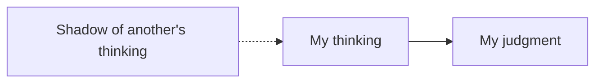

> Perspective expands, but direction is not shown.

---

## 13. Clarifying the Purpose of Use

Shadow Replay is designed primarily for  
**research and learning.**

However, its use is not limited to those purposes.

- Thinking comparison
- Decision retrospective
- Understanding knowledge context
- Team reviews
- Self-reflection

It can be used as long as it does not replace judgment.

---

## 14. Summary

### The v1.7 Milestone

- Thinking can be stored
- Judgment is not lost
- Hesitation remains as value
- You can learn from others' thinking
- Yet judgment is always your own

Thinking Workflow UI has reached a point of completion in v1.7  
as **a UI that maximizes the possibilities of thinking  
without taking away judgment.**

---

## 15. UI Screenshots

- DEMO URL: https://thinking-rag-ui-demo.mymem.net/

### PC

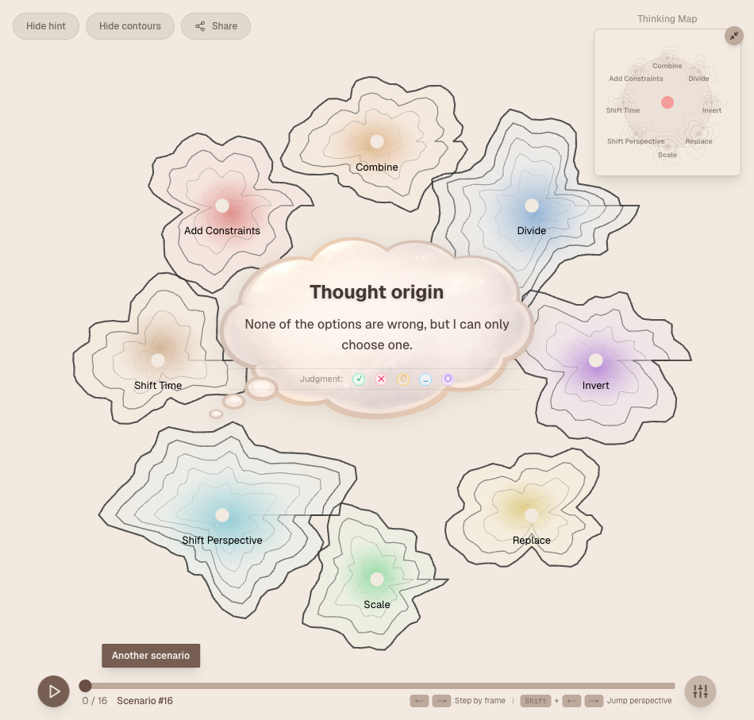
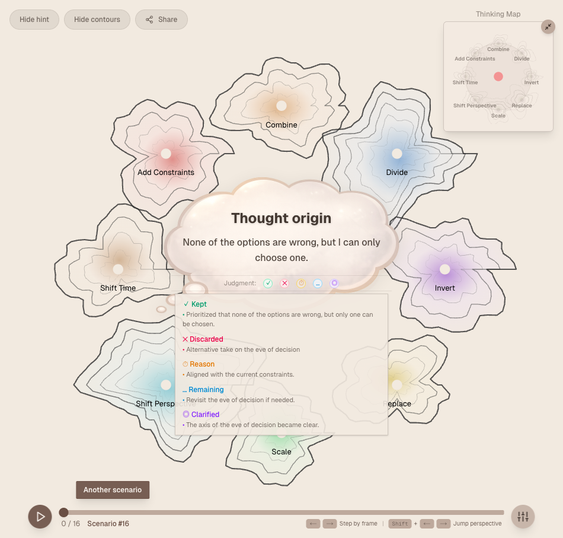
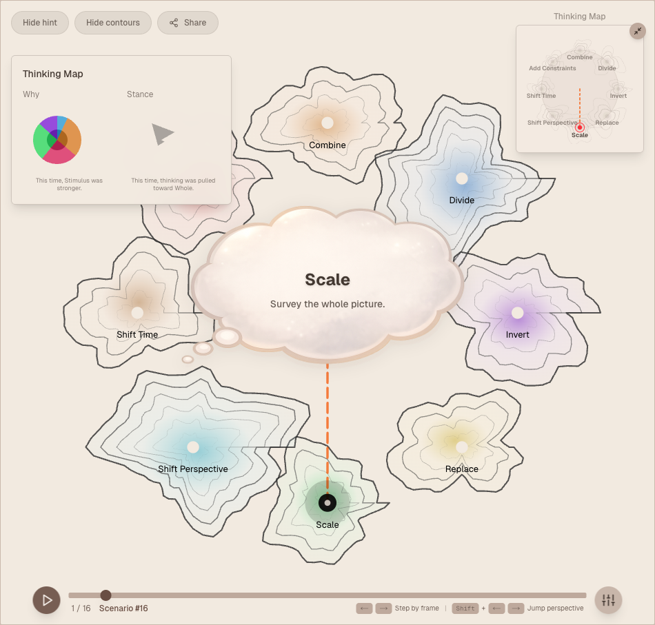
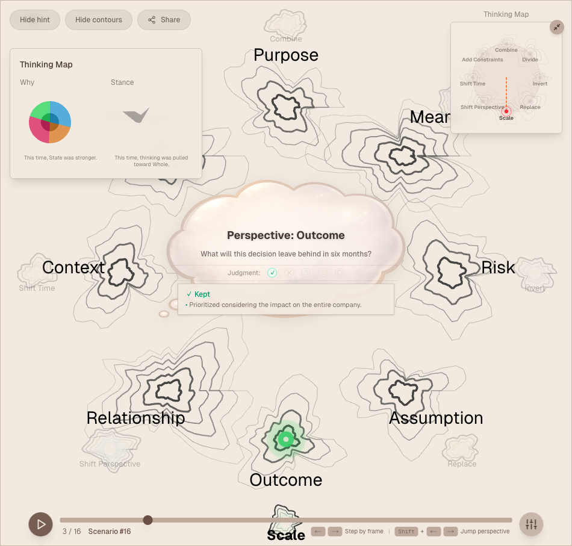
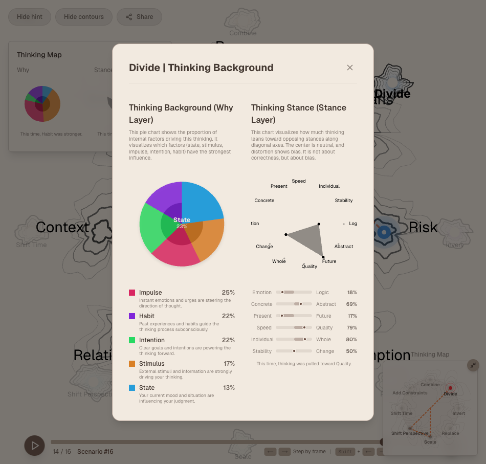
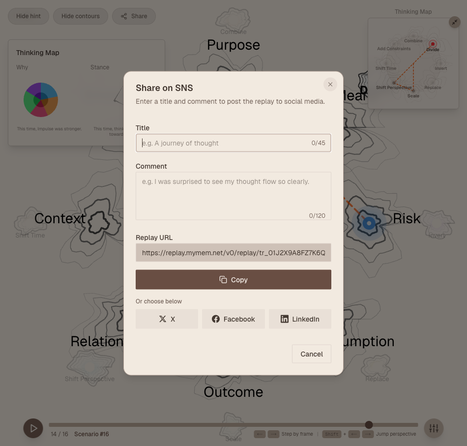
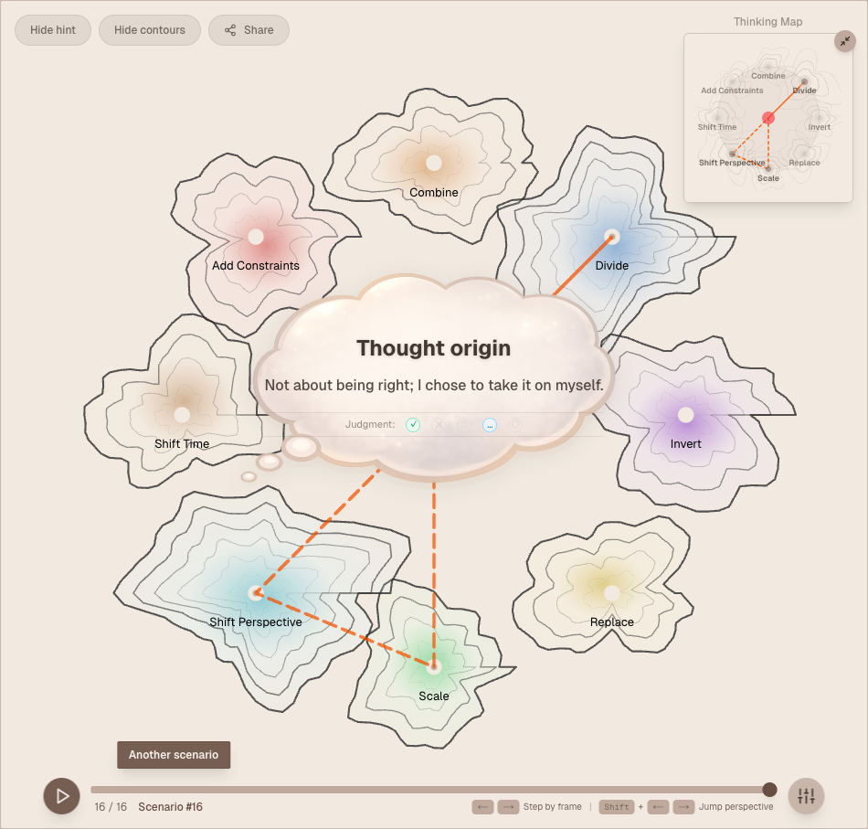

### Mobile

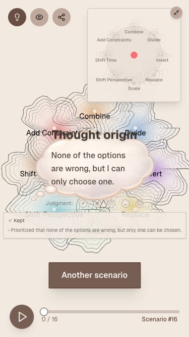
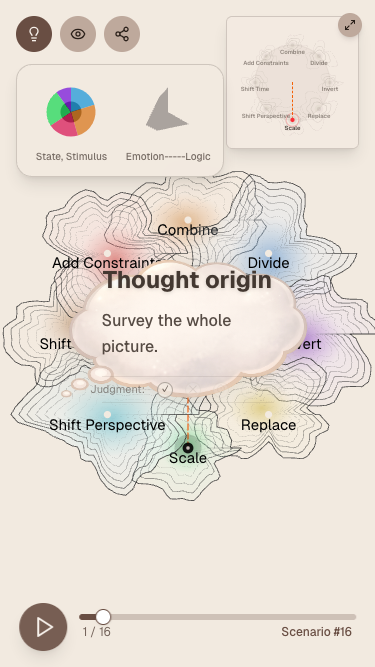
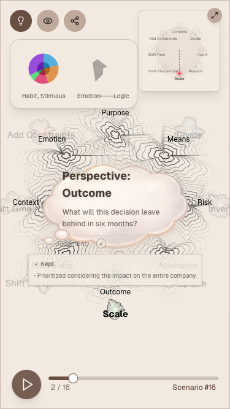
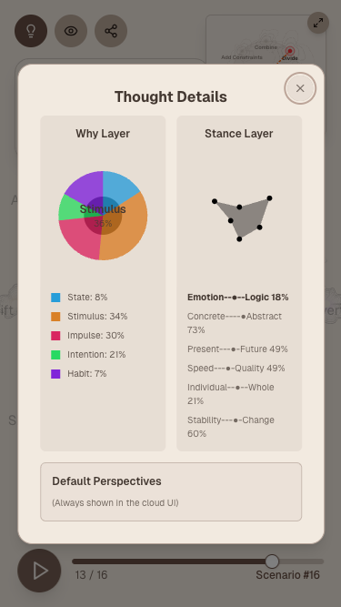
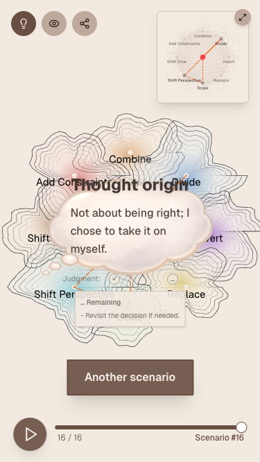

---

## Call to Action

- Thinking Workflow UI demo release
- mymem Pro pilot release
- Thinking research and implementation validation including Shadow Replay
- Applied product examples using the mymem Thinking RAG Engine
- Contact us if you are interested in early testing of mymem Pro

---

This repository publishes the original text of the Thinking RAG whitepaper.
All rights related to this whitepaper belong to the authors.
Commercial use, redistribution, and modification (derivative use) are prohibited
without explicit permission from the authors.
